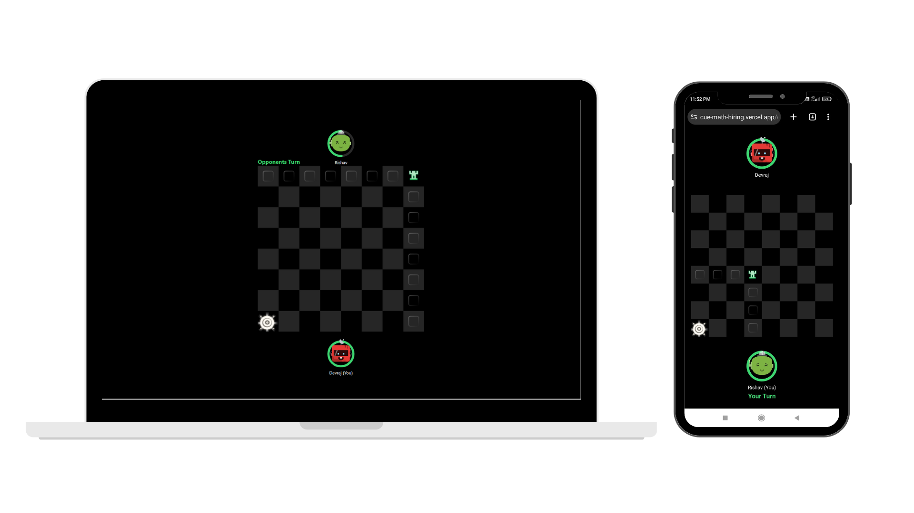

## Rook Game Backend

<p align="center">
  
</p>

<p align="center">
  <a href="https://cue-math-hiring.vercel.app/" rel="noopener">Play Rook Game</a>
</p>

## Table of Contents

- [Rook Game Backend](#rook-game-backend)
- [Table of Contents](#table-of-contents)
- [Introduction](#introduction)
- [Game Rules](#game-rules)
- [Tech Stack for Backend](#tech-stack-for-backend)
- [Installation](#installation)
    - [1. Clone the repository](#1-clone-the-repository)
    - [2. Install the packages](#2-install-the-packages)
    - [3. Run the server](#3-run-the-server)
- [Project File Structure](#project-file-structure)
- [API Endpoints](#api-endpoints)
    - [1. Create a new game](#1-create-a-new-game)
    - [2. Check if game exists](#2-check-if-game-exists)
- [Socket Event Handlers](#socket-event-handlers)
    - [1. socket.on("disconnect") :](#1-socketondisconnect-)
    - [2. socket.on("join-game") :](#2-socketonjoin-game-)
    - [3. socket.on("rook-moved") :](#3-socketonrook-moved-)
    - [4. socket.on("timer-ended") Event:](#4-socketontimer-ended-event)
- [Socket Emmited Events](#socket-emmited-events)
    - [1. socket.emit("game-not-found") :](#1-socketemitgame-not-found-)
    - [2. socket.emit("game-ended", game) :](#2-socketemitgame-ended-game-)
    - [3. socket.emit("already-busy") :](#3-socketemitalready-busy-)
    - [4. socket.emit("start-game", game) :](#4-socketemitstart-game-game-)
    - [5. socket.emit("update-rook-position", { rookRow, rookCol }) :](#5-socketemitupdate-rook-position--rookrow-rookcol--)
    - [6. socket.emit("you-win", game) :](#6-socketemityou-win-game-)
- [Project Motivation](#project-motivation)
- [Key Objectives](#key-objectives)
- [Learning Outcomes](#learning-outcomes)
- [Future Enhancements](#future-enhancements)


## Introduction

Welcome to the Rook Move Game, a thrilling 1v1 chess-inspired challenge where strategic thinking and quick decision-making are the keys to victory! In this fast-paced game, players navigate an 8x8 chessboard, guiding their rook pieces to race to the bottom-left corner before their opponent does. Let the battle of wits begin!

## Game Rules

1. **Objective:** The goal of the game is to reach the bottom-left corner of the 8x8 chessboard before your opponent.

2. **Starting Position:** Players begin with their rook pieces at the top-right corner of the chessboard.

3. **Moves:** On each turn, a player can move their rook any number of steps to the left or down. Diagonal moves and movements in other directions are not allowed.

4. **Multiplayer Gameplay:** This game supports real-time multiplayer functionality. Players can connect and compete against each other in real-time matches.

5. **Turn Timer:** Each player has 30 seconds to make their move. If a player fails to make a move within the allocated time, the game ends, and their opponent wins.

6. **Victory:** The first player to reach the bottom-left corner of the chessboard wins the game and is declared the ultimate Rook Move champion!

Are you ready to outmaneuver your opponent, plan your moves wisely, and claim victory in the Rook Move Game? Let the race to the finish line begin!


## Tech Stack for Backend

- Node.js - JavaScript runtime environment
- Express.js - Web application framework
- MongoDB - NoSQL database (I have used MongoDB Atlas for cloud hosting)
- Socket.io - Real-time communication library
- TypeScript - Programming language with static typing
- Render - Hosted on Render


## Installation

#### 1. Clone the repository

```
git clone https://github.com/rishav-jha-mech/Rookgame-Backend.git
```

#### 2. Install the packages

```
npm install
```

#### 3. Run the server

```
npm start
```

This project is hosted on cloud so we are using MONGODB ATLAS for database which will need a URL to connect to the database. So, you need to create a .env file in the root directory and add the following line to it.

```
MONGO_DB_URL=mongodb+srv://<username>:<password>@<databaseurl>/cuemath?retryWrites=true&w=majority
```

**Dont use '<' or '>' in actual url.**

## Project File Structure

```
- src
    - controllers
        - gameController.ts : Contains all the controller functions
    - models
        - Game.ts : Contains the game model
    - routes
        - gameRoutes.ts : Contains all the routes
    - constants.ts : Constants used in the project
    - db.ts : Database connection
    - index.ts : Entry point of the server
- .env.example : Example .env file
```


## API Endpoints

#### 1. Create a new game

```
POST /api/game/createNewGame
PARAMS {
    playerName: string,
    socketId: string
}
```

#### 2. Check if game exists

```
POST /api/game/checkGameExists
PARAMS {
    gameId: string
}
```

## Socket Event Handlers

#### 1. socket.on("disconnect") :

- **Parameters:** `None`
- **Output:** 
  - Updates the game state if a player disconnects. 
  - If the game is completed or the disconnected player is the only one in the game, there might not be any specific output to the clients. 
  - If the game is ongoing and the player disconnects, it updates the game state and emits "game-ended" event to both players with the updated game state.

#### 2. socket.on("join-game") :

- **Parameters:** data object containing gameId (string), player2Name (string), and socketId (string)
- **Output:** Emits various events based on the game's state:
    - If the game is not found: Emits "game-not-found" event to the socket.
    - If the game is already completed: Emits "game-ended" event to the socket with the updated game state.
    - If the game is already full: Emits "already-busy" event to the socket.
    - If the player successfully joins the game: Emits "start-game" event to both players' sockets with the updated game state.

#### 3. socket.on("rook-moved") :

- **Parameters:** data object containing gameId (string), socketId (string), rookRow (number), and rookCol (number)
- **Output:** 
    - Emits "update-rook-position" event to the opponent's socket with the new rook position 
    - if the move is valid and updates the game state. 
    - If the rook reaches the specified position, it updates the game state and emits "game-ended" event to both players with the updated game state.
  
#### 4. socket.on("timer-ended") Event:

- **Parameters:** data object containing gameId (string) and socketId (string)
- **Output:** 
    - Emits "you-win" event to the opponent's socket with the updated game state if the timer ends and the game is not completed.
    - If the game is already completed, there might not be any specific output to the clients. 
    - If the game is not found or the player is not found, it emits "game-not-found" or "already-busy" event, respectively.

## Socket Emmited Events

#### 1. socket.emit("game-not-found") :
- Parameters: None
- Output: Sent to a specific client when the requested game is not found in the database. The client can handle this event to display an error message to the user, indicating that the requested game was not found.

#### 2. socket.emit("game-ended", game) :
- Parameters: game object (contains game state information)
- Output: Sent to both players' sockets when a game is completed. The game object contains updated game state information, including the winner, reason for game completion, and possibly other relevant details. Both clients can handle this event to display the game result to the players.

#### 3. socket.emit("already-busy") :
- Parameters: None
- Output: Sent to a specific client when a player attempts to join a game that is already full (both player slots are occupied). The client can handle this event to inform the user that the game is already in progress and both player slots are taken.

#### 4. socket.emit("start-game", game) :
- Parameters: game object (contains game state information)
- Output: Sent to both players' sockets when a game is successfully started. The game object contains initial game state information, allowing both clients to set up the game interface and display the initial game state to the players.

#### 5. socket.emit("update-rook-position", { rookRow, rookCol }) :
- Parameters: rookRow (number), rookCol (number)
- Output: Sent to the opponent's socket when a player moves their rook on the game board. The { rookRow, rookCol } object contains the new position of the rook. The opponent client can handle this event to update the rook's position on their game board interface.

#### 6. socket.emit("you-win", game) :
- Parameters: game object (contains game state information)
- Output: Sent to the winning player's socket when the game is completed. The game object contains updated game state information, including the winner, reason for game completion, and possibly other relevant details. The winning player's client can handle this event to display a winning message and the game result.


## Project Motivation

The motivation behind this project was driven by a unique opportunity presented by the Cuemath team. Tasked with the challenge as part of Cuemath's game developer hiring process, the project served as a practical assessment of my skills and creativity. Success in this endeavor not only represented a chance to showcase my abilities but also the prospect of joining a forward-thinking team at Cuemath. The project, therefore, became a compelling avenue to prove my expertise, passion, and suitability for the role, motivating me to deliver an exceptional and innovative game development experience.

## Key Objectives

1. **Enhancing Problem-Solving Skills:**
Designing the game logic, implementing the rules, and handling real-time interactions challenged my problem-solving abilities. I delved into the intricacies of chess movements and multiplayer synchronization, fostering my analytical thinking and logical reasoning skills.

2. **Mastering Socket.io for Real-Time Interaction:**
Implementing Socket.io for real-time multiplayer functionality was a significant learning curve. Understanding how to synchronize player moves, handle disconnections, and ensure seamless gameplay experiences deepened my knowledge of websockets and real-time communication.

3. **User-Centric Design:**
I prioritized creating an intuitive and visually appealing user interface to enhance the gaming experience. Utilizing Phaser for rendering the game elements and integrating the provided assets allowed me to focus on enhancing the user experience, ensuring players could easily navigate the game.

## Learning Outcomes
- **Skill Advancements:**
Advanced JavaScript and TypeScript: Writing complex logic for the game rules and backend functionality improved my proficiency in JavaScript and TypeScript.
- **Game Development with Phaser:** Developing a game using Phaser honed my game development skills, from rendering graphics to handling user interactions.
- **Backend Development with Express.js:** Creating a robust backend using Express.js and MongoDB enriched my backend development capabilities.

## Future Enhancements

- **User Authentication:** Implementing user authentication to allow users to create accounts and track their game history.
- **Leaderboard:** Creating a leaderboard to display the top players and their rankings.
- **Game listing:** Creating a game listing page where users can view the ongoing games and join a game of their choice.
- **Tournament Mode:** Implementing a tournament feature where players can compete in structured tournaments.
- **AI Opponent:** Developing an AI opponent for single-player mode, allowing users to practice and enhance their skills.

Creating this project not only enhanced my technical skills but also provided a platform for chess enthusiasts to enjoy a strategic and engaging game. The journey from conceptualization to implementation has been a rewarding experience, encouraging continuous growth in my software development expertise.

<p align="center">
  
</p>
<p align="center">
    <i>Mic Drop!</i>
</p>
<p align="center">
    <i>Thank you for your time!</i>
</p>